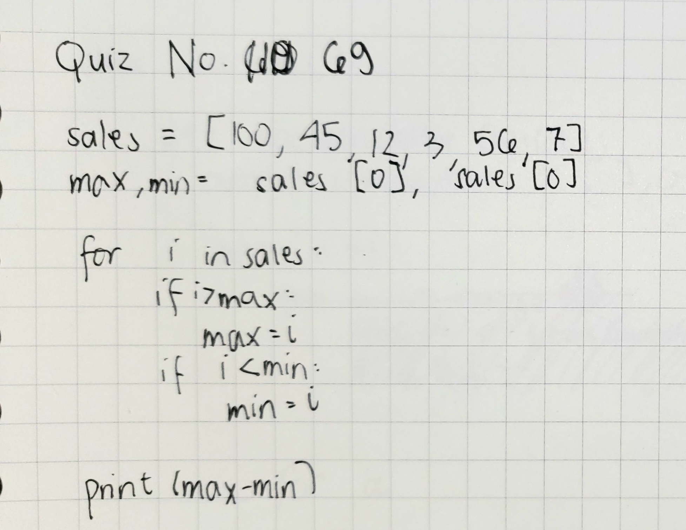
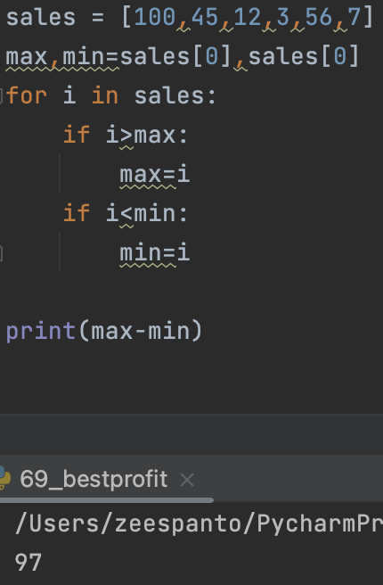

# Quiz 69

[Solution] 



[Code on Pycharm]
```pycon
sales = [100,45,12,3,56,7]
max,min=sales[0],sales[0]
for i in sales:
    if i>max:
        max=i
    if i<min:
        min=i

print(max-min)
```

[Result]
