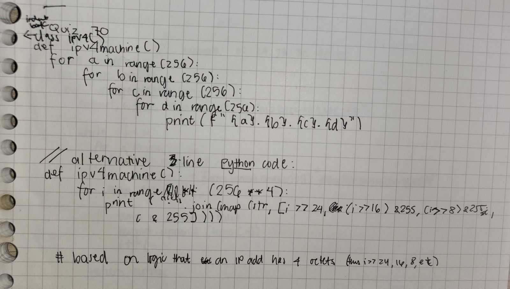

# Quiz 70

[Solution]



[Code on Pycharm]
```pycon
class ipv4():
    def ipv4machine():
        for i in range(256):
            for j in range(256):
                for k in range(256):
                    for l in range(256):
                        print(f'{i}.{j}.{k}.{l}')
```

[Result]
