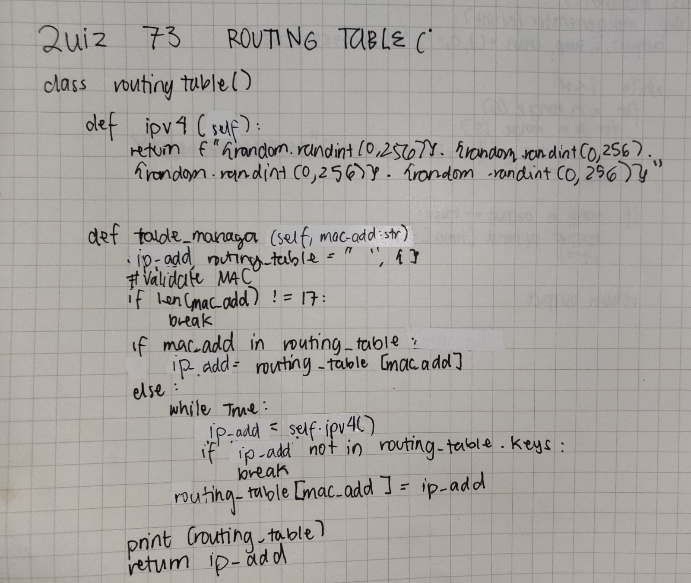
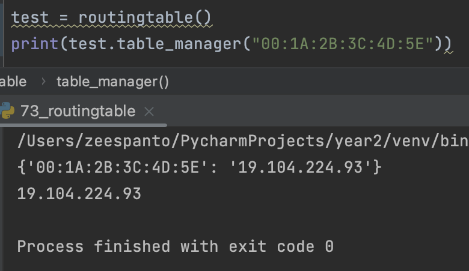

# Quiz 73

[Solution]


[Code on Pycharm]
```pycon
import random
class routingtable():
    def ipv4(self):
        return f"{random.randint(0,256)}.{random.randint(0,256)}.{random.randint(0,256)}.{random.randint(0,256)}"

    def table_manager(self,mac_add:str):
        ip_add, routingtable = "", {}
        #Validate mAC
        if len(mac_add)!=17:
            return "Please enter a valid MAC Address"
        if mac_add in routingtable:
            ip_add = routingtable[mac_add]
        else:
            while True:
                ip_add=self.ipv4()
                if ip_add not in routingtable.keys():
                    break
            routingtable[mac_add]=ip_add
        print(routingtable)
        return ip_add
```

[Result]
