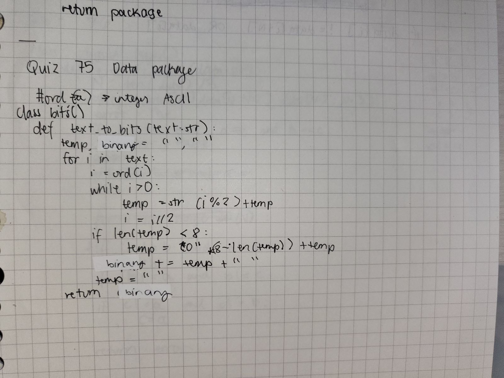
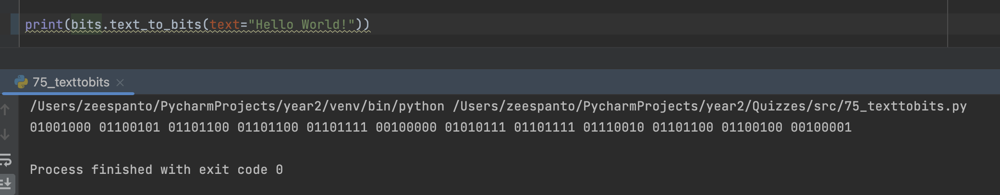

# Quiz 75

[Solution]


[Result]


[Code on Pycharm]
```pycon
class bits():
    def text_to_bits(text:str):
        temp, binary = "",""
        for i in text:
            i=ord(i)
            while i>0:
                temp=str(i%2)+temp
                i=i//2
            if len(temp)<8:
                temp=("0"*(8-len(temp)))+temp
            #output+=temp[::-1]
            binary+=temp+" "
            temp=""
        return binary

print(bits.text_to_bits(text="Hello World!"))
```