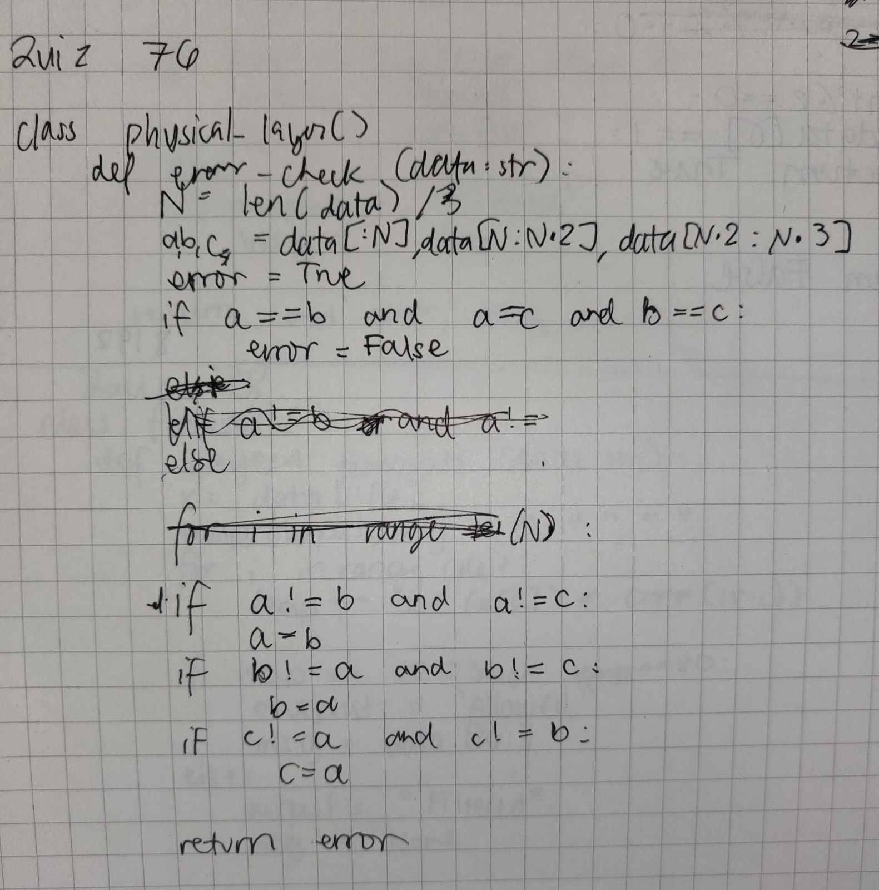
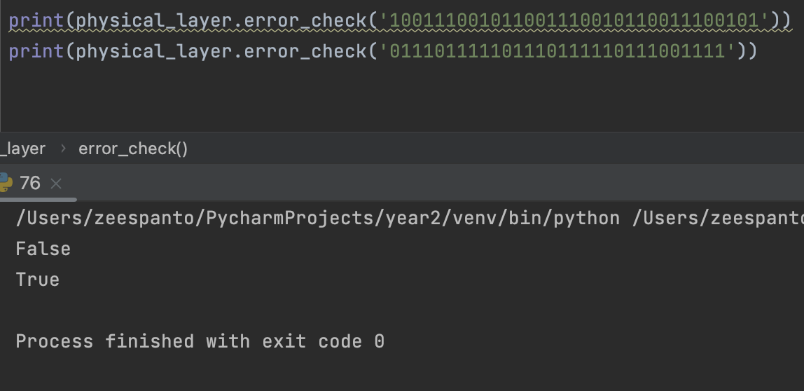

# Quiz 76

[Solution]


[Result]


[Code on Pycharm]
```pycon
class physical_layer(): #HL: CORRECT THE DATA IF THERE IS AN ERROR
    def error_check(data:str):
        N=len(data)//3
        a,b,c = data[:N], data[N:N*2],data[N*2:N*3]
        error=True
        if a==b and a==c and b==c:
            error=False
        #DATA CORRECTION
        elif a!=b and a!=c:
            a=b
        elif b!=a and b!=c:
            b=a
        else:
            c=a
        return error
```