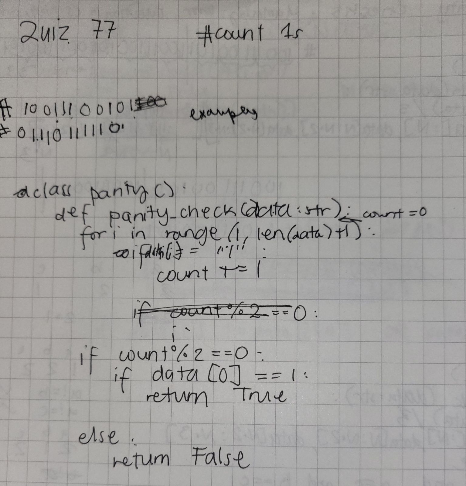

# Quiz 77

[Paper Solution]


[Pycharm Solution]
```pycon
class parity():
    def parity_check(data:str):
        count=0
        for i in range(1,len(data)):
            if data[i]=='1':
                count+=1
        if count%2==0 and data[0]==1:
            return True
        else:
            return False
```

