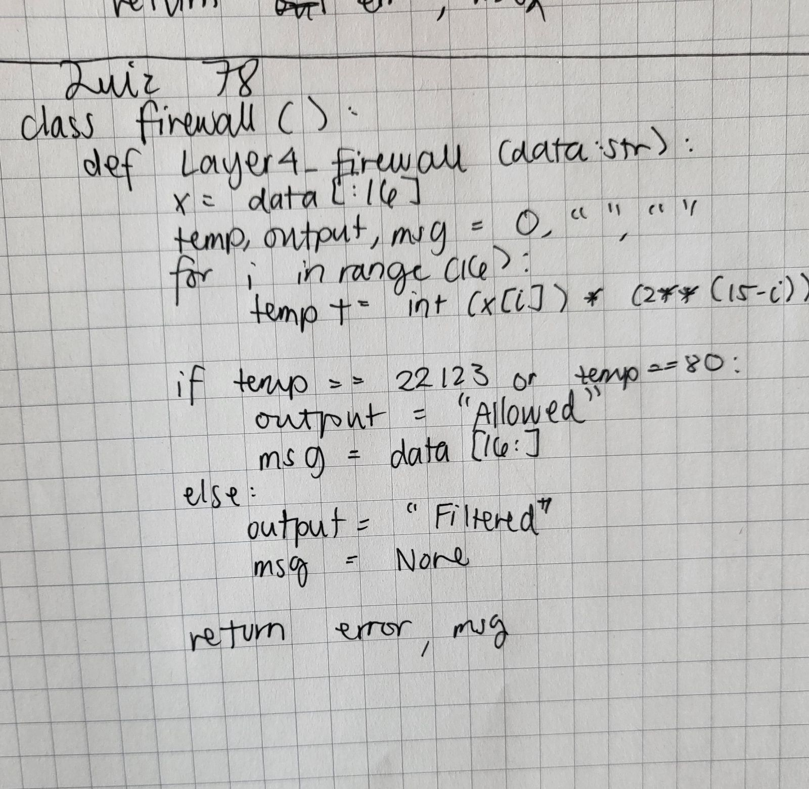
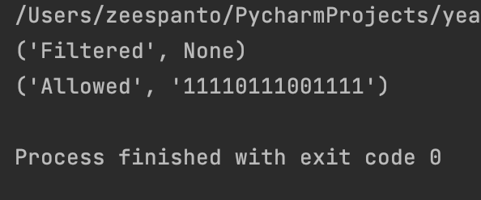

# Quiz 78

[Paper Solution]



[Code on Pycharm]
```pycon
class firewall():
    def Layer4_firewall(data:str):
        x=data[:16]
        temp,output,msg=0,"",""
        for i in range(16):
            temp+=int(x[i])*(2**(15-i))

        if temp==22123 or temp==80:
            output="Allowed"
            msg=data[16:]
        else:
            output="Filtered"
            msg=None
        return output, msg


print(firewall.Layer4_firewall('100111001011001110010110011100101'))
print(firewall.Layer4_firewall('010101100110101111110111001111'))
```

[Result]
