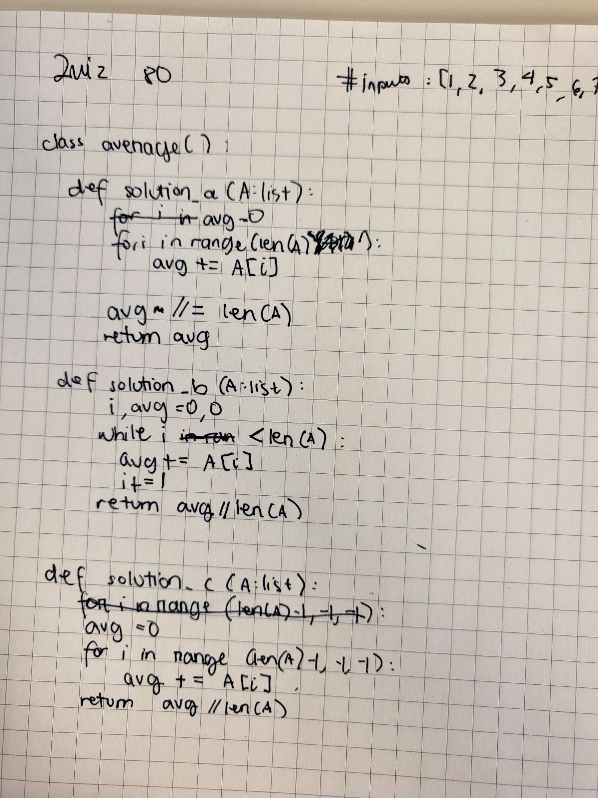
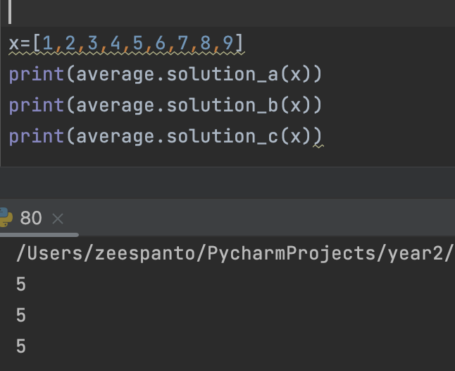

# Quiz 80

[Proof of Work]


[Code on Pycharm]
```pycon
class average():
    def solution_a(A:list):
        avg=0
        for i in range(len(A)):
            avg+=A[i]
        return avg//len(A)

    def solution_b(A:list):
        i,avg=0,0
        while i<len(A):
            avg+=A[i]
            i+=1
        return avg//len(A)

    def solution_c(A:list):
        avg=0
        for i in range(len(A)-1,-1,-1):
            avg+=A[i]
        return avg//len(A)
```

[Result]
